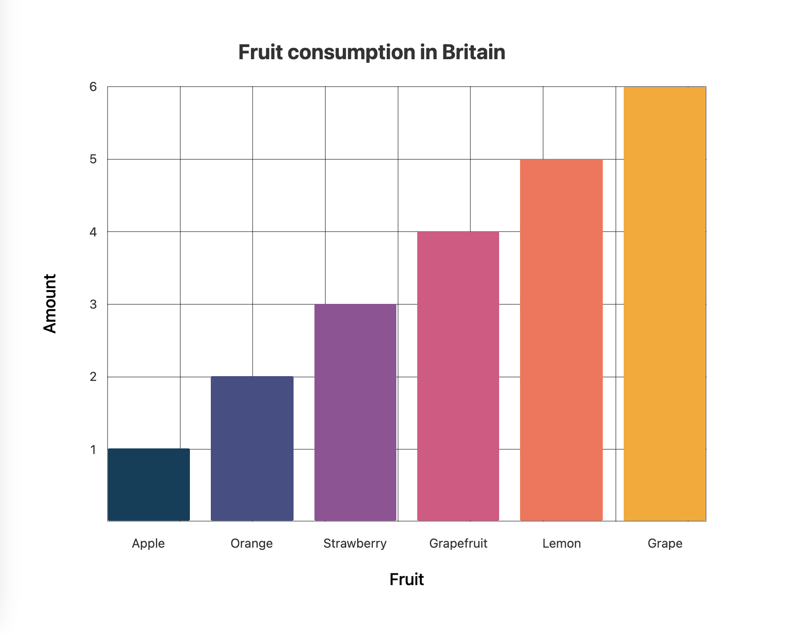
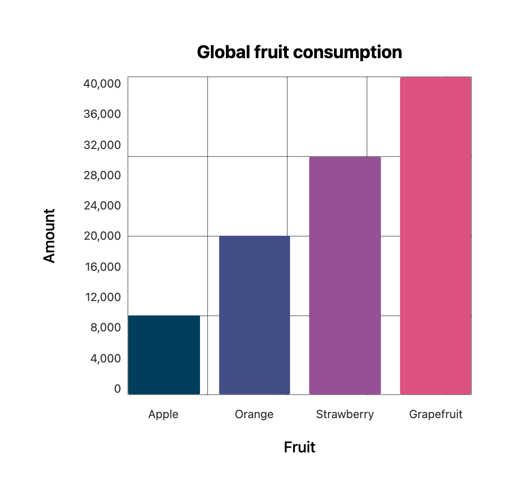

# React Charts

A flexible, composable data visualisation library for React.



## Overview

### The problem

You want to display a chart in your application, but you want to have full control over the markup. styling and functionality.

### The solution

The library exposes a hook for each type of chart. You then consume this hook in your application and compose your own graph using the information supplied by the hook.

## Charts

### Bar Chart



- `useBarChart`

```tsx
const series = [
  { label: "Apple", value: 100, colour: "#003f5c" },
  { label: "Orange", value: 200, colour: "#444e86" },
  { label: "Strawberry", value: 300, colour: "#955196" },
  { label: "Grapefruit", value: 400, colour: "#dd5182" },
];

// ...

const { augmentedSeries, xAxisLabels, yAxisLabels, getBarChartProps } =
  useBarChart({
    series,
    height: 300,
  });
```

#### Options

- `series: { label: string; value: number; colour: string; }[]` - The series of chart data.

  - `label` - The label of the bar on the chart.
  - `value` - The value of the bar on the chart.
  - `colour` - The colour of the bar on the chart.

- `height: number;` - The height of the chart.

#### Returns

- `augmentedSeries` - An augmented/enriched version of the series data with additional properties needed to compose the chart.

  ```
  {
    getBarProps: <TElement extends unknown>({ onClick, style, ...additionalBarProps }?: DetailedHTMLProps<HTMLAttributes<TElement>, TElement>) => DetailedHTMLProps<HTMLAttributes<TElement>, TElement>;
    label: string;
    value: number;
    colour: string;
  }[]
  ```

  - `getBarProps` - A function that returns the necessary collection of properties for the bar on the chart.
  - `label` - The label of the bar on the chart.
  - `value` - The value of the bar on the chart.
  - `colour` - The colour of the bar on the chart.

- `xAxisLabels: string[];` - An array of the x axis labels.
- `yAxisLabels: string[];` - An array of the y axis labels.

- `getBarChartProps` - A function that returns the necessary collection of properties for the parent chart element.

#### Examples

```tsx
const series = [
  { label: "Apple", value: 100, colour: "#003f5c" },
  { label: "Orange", value: 200, colour: "#444e86" },
  { label: "Strawberry", value: 300, colour: "#955196" },
  { label: "Grapefruit", value: 400, colour: "#dd5182" },
];

const BarChart = () => {
  const { augmentedSeries, getBarChartProps } = useBarChart({
    series,
    height: 300,
  });

  return (
    <div {...getBarChartProps()}>
      {augmentedSeries.map(({ getBarProps }) => (
        <div {...getBarProps()} />
      ))}
    </div>
  );
};
```
